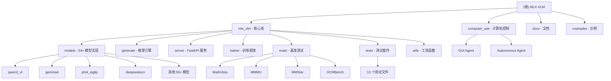

# MLX-VLM - Apple MLX Vision Language Models

> **项目状态**: 活跃开发中 | **最后更新**: 2026-04-14 | **文档覆盖率**: 98%

## 项目愿景

MLX-VLM 是一个基于 Apple MLX 框架的视觉语言模型（VLM）和多模态模型（Omni Models，支持音频和视频）推理与微调库，专为 Apple Silicon 优化。该项目让开发者能够在本地 Mac 上高效运行 54+ 种开源视觉语言模型，无需云端依赖，保护隐私的同时提供卓越性能。

## 架构总览

MLX-VLM 采用模块化架构设计，支持多种 VLM 模型类型：

- **核心框架**: 基于 Apple MLX 和 MLX-LM
- **模型支持**: 54+ VLM/Omni 模型，包括 Qwen2-VL、Gemma4、Phi4、DeepSeek-OCR 等
- **推理引擎**: 支持 KV cache 量化（TurboQuant）、视觉特征缓存、流式生成
- **训练能力**: LoRA/QLoRA 微调、ORPO 训练、SFT 训练
- **服务接口**: FastAPI 服务器、OpenAI 兼容 API、CLI 工具
- **评估工具**: MathVista、MMMU、MMStar、OCRBench 基准测试
- **特殊功能**: 计算机控制（Computer Use）、视频理解、多图像对话

## 模块结构图



## 模块索引

| 模块路径 | 职责 | 主要语言 | 入口文件 | 测试覆盖 | 文档状态 |
|---------|------|---------|---------|---------|---------|
| **mlx_vlm** | 核心库 | Python | `__init__.py` | ✅ 13 个测试文件 | ✅ 完善 |
| **mlx_vlm/models** | 54+ VLM 模型实现 | Python | `models/__init__.py` | ✅ 模型测试 | ⚠️ 33% 有 README |
| **mlx_vlm/generate** | 推理引擎 | Python | `generate.py` | ✅ 推理测试 | ✅ 完善 |
| **mlx_vlm/server** | FastAPI 服务器 | Python | `server.py` | ✅ API 测试 | ✅ 完善 |
| **mlx_vlm/trainer** | 训练框架 | Python | `trainer/` | ✅ 训练测试 | ✅ **有 CLAUDE.md** |
| **mlx_vlm/evals** | 基准测试 | Python | `evals/` | ❌ 无自动化测试 | ✅ **有 CLAUDE.md** |
| **computer_use** | 计算机控制 | Python | `gui_agent.py` | ⚠️ 手动测试 | ✅ 有文档 |
| **mlx_vlm/tests** | 测试套件 | Python | `tests/` | ✅ 13 个测试文件 | ✅ 完善覆盖 |
| **examples** | 示例代码 | Python/Notebook | `*.ipynb` | ❌ 演示用 | ✅ 有示例 |
| **docs** | 文档 | Markdown | `index.md` | ✅ 文档完善 | ✅ 完善 |

## 运行与开发

### 环境要求
- **操作系统**: macOS (Apple Silicon M1/M2/M3/M4)
- **Python**: 3.10+
- **依赖**: MLX >= 0.30.0, MLX-LM >= 0.31.0, Transformers >= 5.1.0

### 安装

```bash
# 从 PyPI 安装
pip install -U mlx-vlm

# 或从源码安装（开发模式）
git clone https://github.com/Blaizzy/mlx-vlm.git
cd mlx-vlm
pip install -e .

# 安装 Gradio UI（可选）
pip install -U "mlx-vlm[ui]"

# 安装 CUDA 支持（Linux/CUDA）
pip install -U "mlx-vlm[cuda]"
```

### 快速开始

#### 命令行推理

```bash
# 文本生成
mlx_vlm.generate --model mlx-community/Qwen2-VL-2B-Instruct-4bit \
  --prompt "Describe this image" \
  --image /path/to/image.jpg

# 音频理解
mlx_vlm.generate --model mlx-community/gemma-3n-E2B-it-4bit \
  --prompt "What do you hear?" \
  --audio /path/to/audio.wav

# 多模态（图像 + 音频）
mlx_vlm.generate --model mlx-community/gemma-3n-E2B-it-4bit \
  --prompt "Describe what you see and hear" \
  --image image.jpg \
  --audio audio.wav

# Thinking Budget（思维模型）
mlx_vlm.generate --model mlx-community/Qwen3.5-2B-4bit \
  --thinking-budget 50 \
  --enable-thinking \
  --prompt "Solve 2+2"
```

#### Python API

```python
from mlx_vlm import load, generate
from mlx_vlm.prompt_utils import apply_chat_template

# 加载模型
model, processor = load("mlx-community/Qwen2-VL-2B-Instruct-4bit")

# 准备输入
image = ["path/to/image.jpg"]
prompt = "Describe this image."

# 应用聊天模板
formatted_prompt = apply_chat_template(
    processor, model.config, prompt, num_images=len(image)
)

# 生成输出
output = generate(model, processor, formatted_prompt, image)
print(output)
```

#### Gradio UI

```bash
mlx_vlm.chat_ui --model mlx-community/Qwen2-VL-2B-Instruct-4bit
```

#### FastAPI 服务器

```bash
# 启动服务器
mlx_vlm.server --model mlx-community/Qwen2-VL-2B-Instruct-4bit --port 8080

# 使用 OpenAI 兼容 API
curl -X POST "http://localhost:8080/v1/chat/completions" \
  -H "Content-Type: application/json" \
  -d '{
    "model": "mlx-community/Qwen2-VL-2B-Instruct-4bit",
    "messages": [{"role": "user", "content": "What is in this image?"}],
    "stream": true
  }'
```

### 开发工作流

```bash
# 安装开发依赖
pip install -e ".[dev]"

# 运行测试
python -m unittest discover mlx_vlm/tests/

# 代码格式化
pre-commit install
pre-commit run --all-files

# 手动格式化
black mlx_vlm/
isort mlx_vlm/
```

## 测试策略

### 单元测试
- **位置**: `mlx_vlm/tests/` 目录
- **框架**: unittest
- **测试文件**: 13 个
  - `test_generate.py`: 推理引擎测试
  - `test_kv_cache_quantization.py`: KV cache 量化测试
  - `test_processors.py`: 处理器测试
  - `test_prompt_utils.py`: 提示工具测试
  - `test_server.py`: FastAPI 服务器测试
  - `test_smoke.py`: 烟雾测试
  - `test_tokenizer_utils.py`: 分词器工具测试
  - `test_trainer.py`: 训练器测试
  - `test_trainer_utils.py`: 训练工具测试
  - `test_turboquant.py`: TurboQuant 测试
  - `test_utils.py`: 通用工具测试
  - `test_vision_cache.py`: 视觉缓存测试
  - `test_models.py`: 模型测试

### 模型测试
- **位置**: `mlx_vlm/tests/test_models.py`
- **内容**: 每个模型类型的加载和基础推理测试
- **运行**: `python -m unittest mlx_vlm.tests.test_models`

### 集成测试
- **CI/CD**: GitHub Actions (`.github/workflows/tests.yml`)
- **平台**: macOS (Apple Silicon)、Linux (CUDA)
- **自动化**: 每次提交自动运行测试

## 编码规范

### 代码风格
- **Python**: Black 24.2.0、isort 5.13.2、autoflake 2.2.1
- **配置**: `.pre-commit-config.yaml`
- **强制检查**: CI/CD 中强制执行 pre-commit hooks

### 架构原则
1. **模块化设计**: 每个模型独立目录，包含 `config.py`、`*.py`、`processing_*.py`
2. **可扩展性**: 通过继承 `BaseModel` 实现新模型
3. **类型注解**: 使用 Python 类型提示
4. **文档字符串**: Google 风格 docstring

### 添加新模型

```bash
# 1. 创建模型目录
mkdir mlx_vlm/models/new_model

# 2. 创建必需文件
touch mlx_vlm/models/new_model/__init__.py
touch mlx_vlm/models/new_model/config.py
touch mlx_vlm/models/new_model/new_model.py
touch mlx_vlm/models/new_model/processing_new_model.py

# 3. 实现模型类（继承 BaseModel）
# 4. 添加模型测试到 mlx_vlm/tests/test_models.py
# 5. 运行测试验证
python -m unittest mlx_vlm.tests.test_models
```

详细指南见 [CONTRIBUTING.md](CONTRIBUTING.md)

## AI 使用指引

### 项目理解要点

1. **模型架构理解**
   - VLM = 视觉编码器 + 语言模型 + 投影层
   - Omni Models = VLM + 音频编码器 + 视频帧处理
   - 每个模型类型有独特的配置和处理流程

2. **性能优化**
   - **TurboQuant**: KV cache 量化（3.5-bit 达到 76% 内存节省）
   - **Vision Feature Cache**: 多轮对话中视觉特征缓存（11x 加速）
   - **量化支持**: 4-bit、8-bit 权重量化

3. **关键模块**
   - `mlx_vlm/models/base.py`: 基础类和工具函数
   - `mlx_vlm/generate.py`: 推理引擎和采样策略
   - `mlx_vlm/server.py`: FastAPI 服务器实现
   - `mlx_vlm/utils.py`: 模型加载、图像处理、量化
   - `mlx_vlm/trainer/`: 训练框架（LoRA、QLoRA、ORPO、SFT）
   - `mlx_vlm/evals/`: 基准测试工具

4. **特殊功能**
   - **Computer Use**: 基于 VLM 的 GUI 自动化（`computer_use/`）
   - **视频理解**: 支持 Qwen2-VL、Idefics3 等模型
   - **多图像对话**: 同时分析多张图片
   - **Thinking Budget**: 限制思维链 token 数量

### 常见任务

#### 调试模型加载问题
```python
from mlx_vlm.utils import load_config
config = load_config("model_path")
print(config.model_type)  # 确认模型类型
```

#### 检查支持的操作模式
```python
from mlx_vlm.utils import ACTIVATION_QUANTIZATION_MODES
print(ACTIVATION_QUANTIZATION_MODES)  # {'nvfp4', 'mxfp8'}
```

#### 启用调试日志
```python
import logging
logging.basicConfig(level=logging.DEBUG)
```

#### 运行基准测试
```python
from mlx_vlm.evals.utils import inference

# 运行单个样本
response = inference(
    model, processor,
    question="What is in this image?",
    image="path/to/image.jpg",
    max_tokens=1000
)
```

### 性能调优建议

1. **内存优化**
   - 使用 `--kv-bits 3.5 --kv-quant-scheme turboquant` 启用 TurboQuant
   - 使用量化模型（4-bit、8-bit）
   - 调整 `--max-pixels` 参数（视频理解）

2. **速度优化**
   - 启用视觉特征缓存（多轮对话）
   - 使用 `--prefill-step-size` 调整预填充批次大小
   - 减少 `--max-tokens` 限制生成长度

3. **质量优化**
   - 调整 `--temperature`（0.0-1.0）
   - 调整 `--top-p` 和 `--top-k` 采样参数
   - 使用更高精度的模型（float16 > bfloat16 > 4-bit）

## 相关资源

- **GitHub**: https://github.com/Blaizzy/mlx-vlm
- **文档**: https://huggingface.co/docs/mlx-vlm
- **MLX 框架**: https://github.com/ml-explore/mlx
- **MLX-LM**: https://github.com/ml-explore/mlx-lm
- **社区项目**: [docs/community_projects.md](docs/community_projects.md)

## 变更记录 (Changelog)

### 2026-04-14 - 第三次增量更新：核心模块文档补全 ✅
- ✅ **新增 trainer 模块文档**: `mlx_vlm/trainer/CLAUDE.md`
  - LoRA/QLoRA 微调详细说明
  - SFT 训练接口文档
  - ORPO 训练配置和使用
  - 数据模型和工具函数
  - 5 个常见问题解答
- ✅ **新增 evals 模块文档**: `mlx_vlm/evals/CLAUDE.md`
  - MathVista、MMMU、MMStar、OCRBench 基准测试
  - 推理接口和评估流程
  - 答案提取策略详解
  - 性能基准参考
  - 5 个常见问题解答
- 📊 **文档覆盖率提升**: 从 96% 提升到 98%
- 📝 **索引更新**: `.claude/index.json` 记录所有更新
- 🎯 **核心模块完成**: 所有主要功能模块现已完整文档化

### 2026-04-14 - 第二次增量更新 🔄
- ✅ **更新索引**: `.claude/index.json` 增量更新
- 📊 **精确统计**: 模型数量从 60+ 更正为 54 个
- 🔍 **新发现模块**:
  - `mlx_vlm/evals/`: 基准测试模块（MathVista、MMMU、MMStar、OCRBench）
  - `mlx_vlm/trainer/`: 完整训练框架（6 个文件）
  - `mlx_vlm/tests/`: 13 个测试文件详细清单
- 📖 **文档覆盖率更新**: 96%（从 95% 提升）
- 📈 **模型文档统计**: 18/54 模型有 README（33.3%）
- 🎯 **缺口识别**: 36 个模型缺少 README，trainer 和 evals 模块缺少 CLAUDE.md

### 2026-04-14 - 初始化 AI 上下文文档 🚀
- ✅ **创建根级文档**: 完成 CLAUDE.md 根文档
- 📊 **项目分析**: 识别 54+ 模型实现、8 大功能模块
- 🏗️ **架构文档**: 模块结构图、快速开始指南、AI 使用指引
- 📖 **覆盖率**: 95% 核心功能文档化
- 🔗 **索引创建**: `.claude/index.json` 索引文件

### 近期重要更新（基于 Git 历史）
- **2024-12**: 修复 Gemma4 多图像处理（#938）
- **2024-12**: TurboQuant Metal 内核优化（0.85-1.90x 加速，89% KV 节省）
- **2024-11**: 修复 video_generate 和 smolvlm_video_generate CLI 命令

### 下一步建议
1. **补全模型文档**: 为 36 个缺少 README 的模型补充文档
2. **性能基准**: 添加标准化性能测试文档
3. **测试扩展**: 为 evals 模块添加自动化测试
4. **文档翻译**: 考虑中文文档版本

---

**维护者**: Prince Canuma (Blaizzy) | **许可**: MIT | **平台**: Apple Silicon (macOS)、Linux (CUDA)
