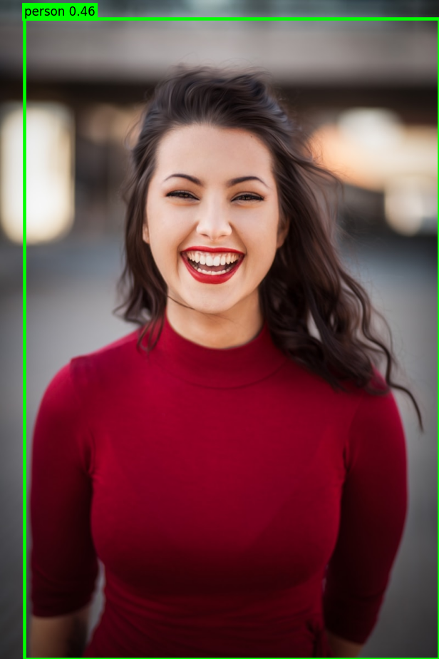

# RTMDet for MLX

Port of [OpenMMLab's RTMDet](https://github.com/open-mmlab/mmdetection/tree/main/configs/rtmdet)
to mlx-vlm, with a focus on the single-class **person detector** shipped by
Meta as [`facebook/sapiens-pose-bbox-detector`](https://huggingface.co/facebook/sapiens-pose-bbox-detector).
This checkpoint is the first stage of Sapiens2's top-down pose pipeline — it
produces person bounding boxes that are then fed to
[`facebook/sapiens2-pose-*`](https://huggingface.co/collections/facebook/sapiens2).

## Install

```bash
pip install -U mlx-vlm
```

## Convert the checkpoint

```bash
python -m mlx_vlm.models.rtmdet.convert \
    --hf-repo facebook/sapiens-pose-bbox-detector \
    --out ./rtmdet-person-mlx \
    --dtype bfloat16
```

This downloads the .pth from HF, applies the MLX weight-layout transforms,
and writes `config.json`, `preprocessor_config.json`, and
`model.safetensors` into the output directory.

## Quick start

```python
from pathlib import Path
from PIL import Image
from mlx_vlm.utils import load_model
from mlx_vlm.models.rtmdet.processing_rtmdet import RTMDetProcessor
from mlx_vlm.models.rtmdet.generate import RTMDetPredictor

model = load_model(Path("./rtmdet-person-mlx"))
processor = RTMDetProcessor.from_pretrained("./rtmdet-person-mlx")
predictor = RTMDetPredictor(
    model, processor,
    score_threshold=0.3,
    nms_iou_threshold=0.65,
)

result = predictor.predict(Image.open("image.jpg"))
for box, score in zip(result.boxes, result.scores):
    x1, y1, x2, y2 = box
    print(f"person: score={score:.2f}  box=({x1:.0f}, {y1:.0f}, {x2:.0f}, {y2:.0f})")
```

Output is a `DetectionResult` with:
- `boxes`  — `(N, 4)` xyxy in original-image pixels
- `scores` — `(N,)` confidence scores in `[0, 1]`
- `labels` — `(N,)` class indices (always `0` for the single-class person detector)

## Plotting detections

```python
import matplotlib.pyplot as plt

image = Image.open("image.jpg")
result = predictor.predict(image)

fig, ax = plt.subplots(figsize=(image.width / 110, image.height / 110))
ax.imshow(image)
for (x1, y1, x2, y2), score in zip(result.boxes, result.scores):
    ax.add_patch(plt.Rectangle((x1, y1), x2 - x1, y2 - y1,
                               fill=False, edgecolor="lime", linewidth=3))
    ax.text(x1, max(0, y1 - 6), f"person {score:.2f}",
            color="black", fontsize=11,
            bbox=dict(facecolor="lime", edgecolor="none", pad=2))
ax.set_axis_off()
plt.savefig("detection.png", bbox_inches="tight", pad_inches=0)
```

Result on `assets/sample.jpg` (Unsplash, 800 × 1200):



## Using it with Sapiens2 pose

The typical flow is: **RTMDet → per-person crops → Sapiens2 pose**.  The
Sapiens2 predictor takes an RTMDet (or RF-DETR) predictor via its
`detector=` argument and handles cropping + stitching automatically:

```python
from mlx_vlm.models.sapiens2.processing_sapiens2 import Sapiens2Processor
from mlx_vlm.models.sapiens2.generate import Sapiens2Predictor

pose_model = load_model(Path("mlx-community/sapiens2-pose-0.4b-bf16"))
pose_proc  = Sapiens2Processor.from_pretrained("mlx-community/sapiens2-pose-0.4b-bf16")
pose_pred  = Sapiens2Predictor(pose_model, pose_proc, detector=predictor)

result = pose_pred.predict(Image.open("crowd.jpg"))
for p in result.persons:
    print(f"box={p.box}  # {len(p.keypoints)} keypoints in original coords")
```

See also the [Sapiens2 MLX port](../sapiens2/README.md).

## Architecture

RTMDet-m:

```
 input (640 × 640 RGB, letterboxed + ImageNet-norm on [0, 255])
                     │
                     ▼
          CSPNeXt backbone
    ┌──────┬──────┬──────┬──────┐
  stage1 stage2 stage3 stage4 (+SPPBottleneck)
  → C3 (192, s=8), C4 (384, s=16), C5 (768, s=32)
                     │
                     ▼
          CSPNeXtPAFPN neck
      top-down + bottom-up + out_convs → (192, 192, 192) at (s=8, 16, 32)
                     │
                     ▼
          RTMDetSepBNHead (per-level towers)
    → cls logits (B, H, W, 1) and reg exp-distance (B, H, W, 4)
                     │
                     ▼
          DistancePointBBoxCoder + class-agnostic NMS
                     │
                     ▼
          boxes (xyxy) + scores (+ unletterbox)
```

## File map

```
rtmdet/
├── __init__.py                 module exports + framework aliases
├── config.py                   RTMDetConfig (arch zoo, strides, thresholds)
├── backbone.py                 CSPNeXt + CSPLayer + ChannelAttention + SPPBottleneck
├── neck.py                     CSPNeXtPAFPN
├── head.py                     RTMDetSepBNHead (per-level cls/reg towers)
├── rtmdet.py                   top-level Model + sanitize()
├── processing_rtmdet.py        RTMDetProcessor (letterbox + ImageNet norm)
├── generate.py                 multi-level decode + NMS + RTMDetPredictor
├── convert.py                  HF .pth → MLX converter
├── language.py                 no-op LanguageModel stub
└── README.md                   this file
```

## References

- RTMDet paper: *An Empirical Study of Designing Real-Time Object Detectors* — <https://arxiv.org/abs/2212.07784>
- mmdetection implementation: <https://github.com/open-mmlab/mmdetection/blob/main/mmdet/models/dense_heads/rtmdet_head.py>
- Sapiens2 project: <https://github.com/facebookresearch/sapiens2>

## License

Weights are distributed under the same license as the source checkpoint
(`facebook/sapiens-pose-bbox-detector`); the MLX port code lives under
mlx-vlm's MIT license.
